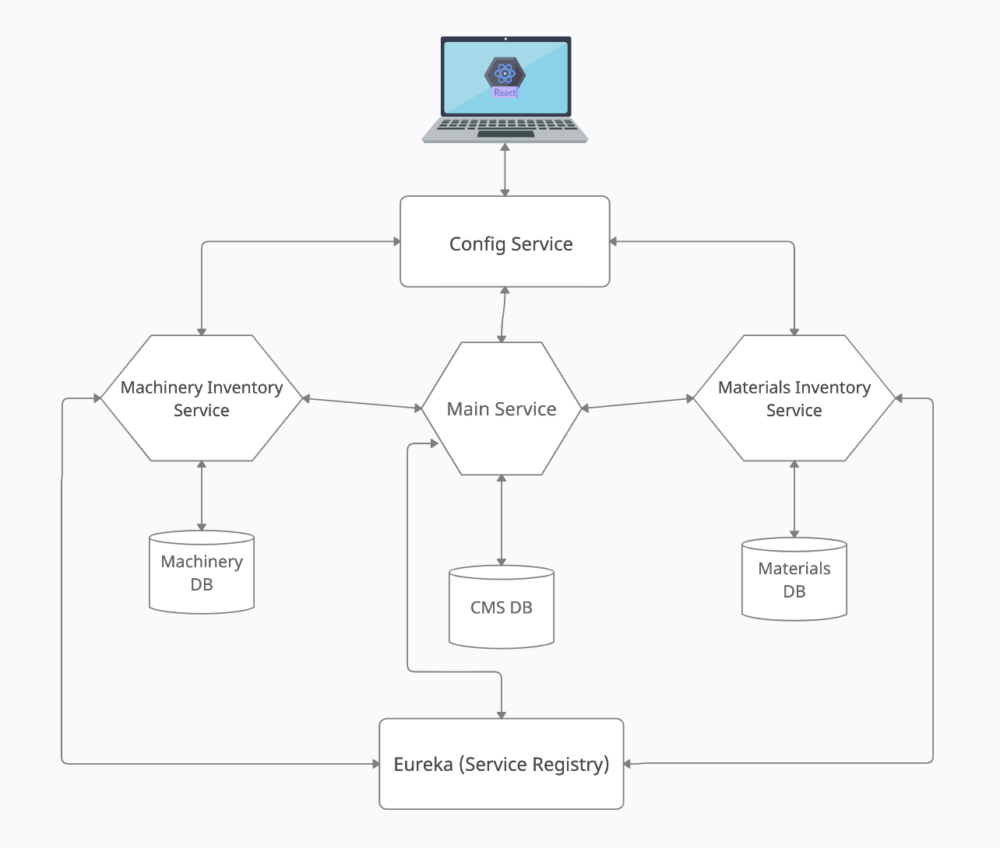
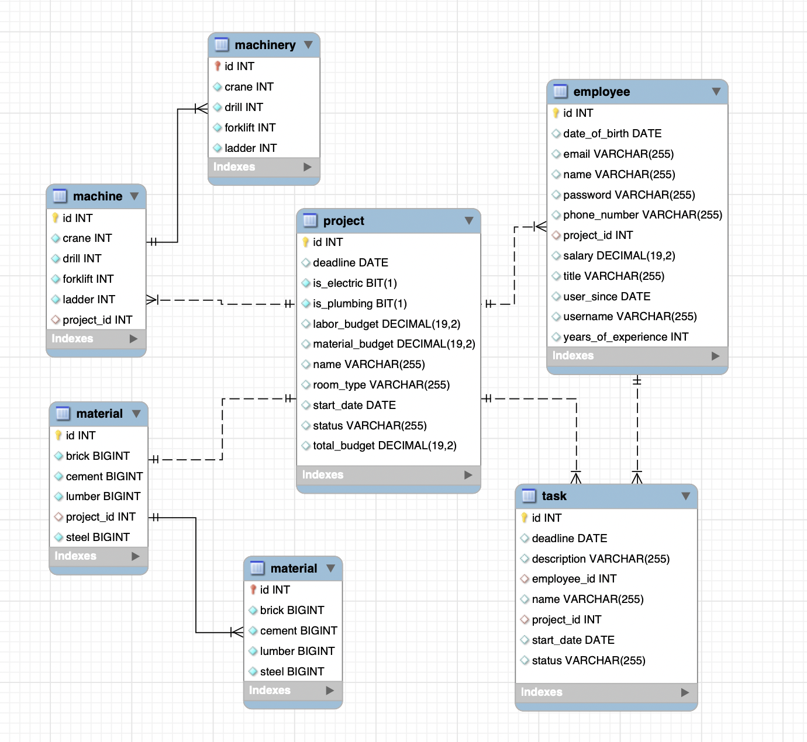
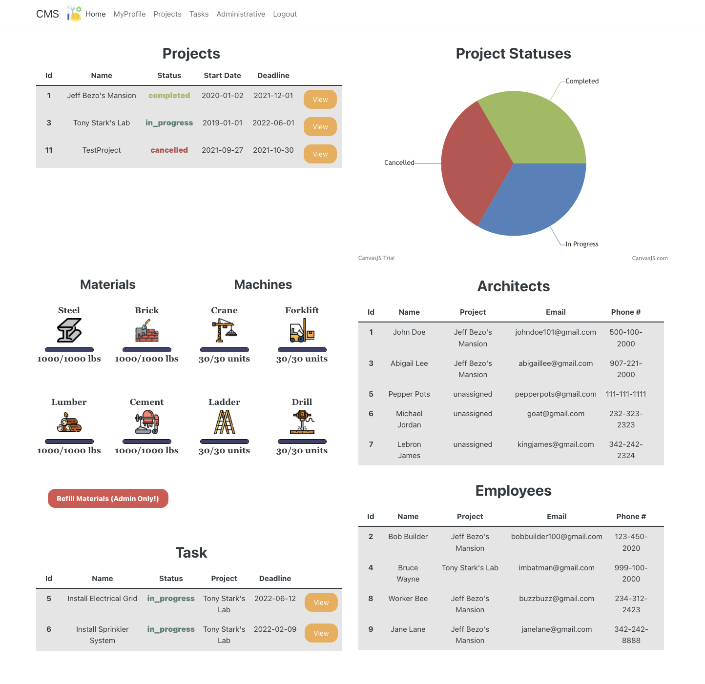
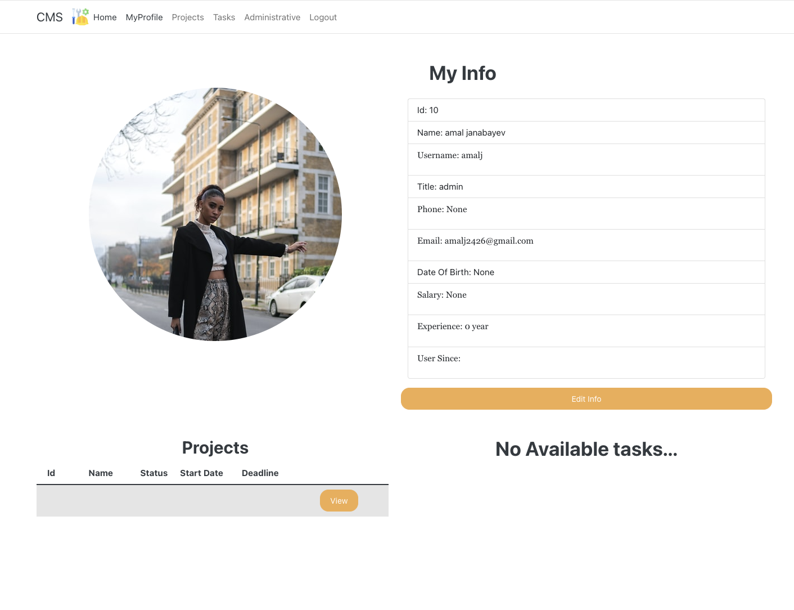
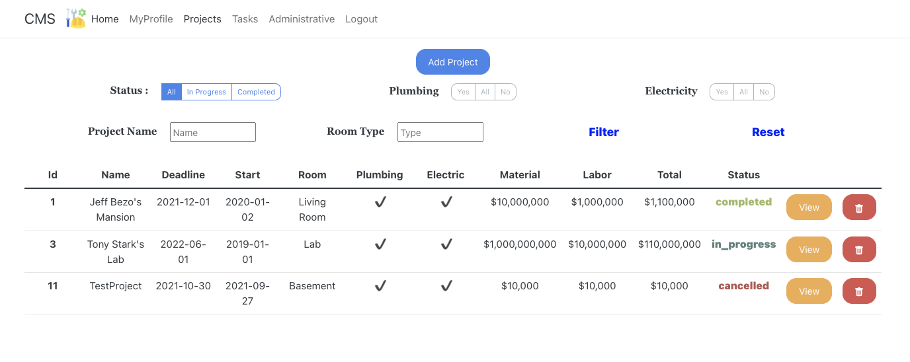
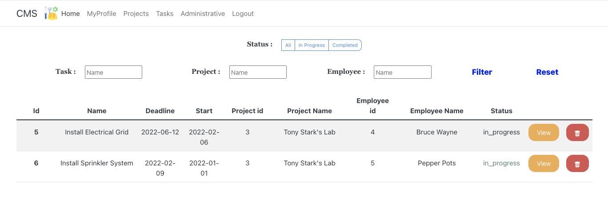
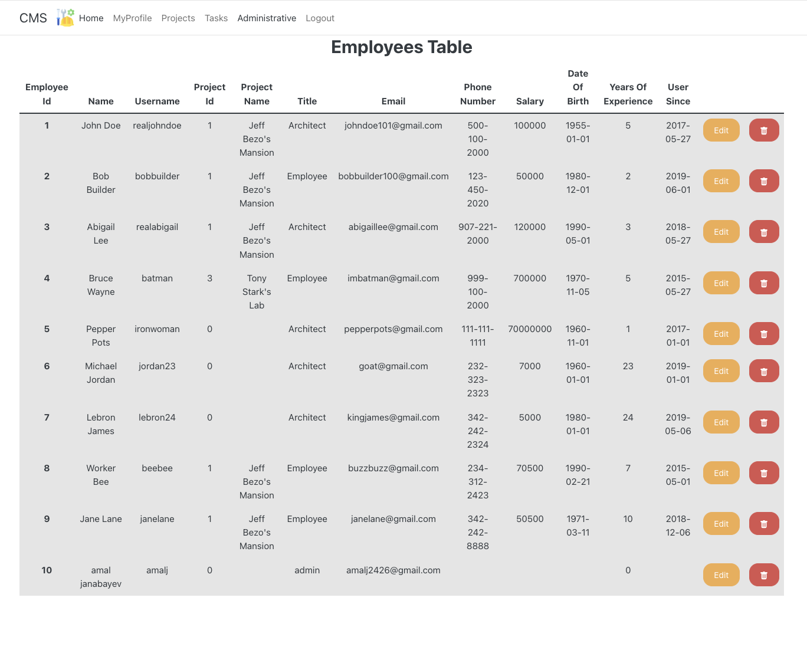

# Construction Management System

## Description
    Construction management system is a web application that is designed for management of construction site facilities (employees and inventory). The purpose of this application is to provide an efficient, fast, easy-to-use workspace for Construction employees to manage their work and inventory.

## Table of Contents:

* [High-level architecture](##High-level-architecture) 
* [Technology Used](##Technology-Used) 
* [UI Mockup](##UI-Mockup)
* [Contributing](##Contributing)
* [Team Members](##Team-Members)
* [Further Development](##Further-Development)

## High-level architecture

## Database Diagram

## Technology Used

* Front End:
    * React
    * Bootstrap

* Back End:
    * Java 8
    * Spring Boot
    * Jwt
    * Feign
    * Testing:
        * MockMVC
        * Mockito
        * Junit4
    * Database:
        * Spring Data JPA
        * MySQL
        

## UI Mockup

## Contributing

    If you would like to contribute to this project or have any suggestions please do the following:
        1. run terminal/bash command - 'git clone https://github.com/CodingErik/constructionManagementSystem.git'
        2. implement your changes to the code on your local branch
        3. Submit a pull request - Our team will review it as soon as possible.

## Team Members

* Eric Chen
* Daniel Yu
* Erik De Luna
* Amal Janabayev

## Further Development

    Our goals for future developement include integrating more microservices for the following business functions related to construction management : Accounting <-> Bookkeeping <-> Schedule Management, Third party vendor request system, payment service for companies to access particular features of the application

## License: 

  ##### Copyright: Amal Janabayev

  ##### 